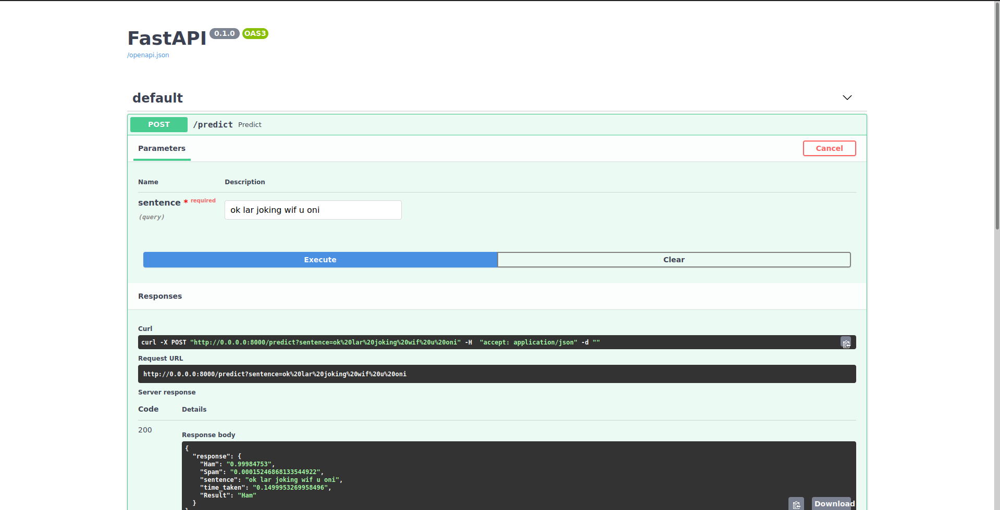

# Spam or Ham classifier Model 

## To reproduce the result 

- Just follow the notebook given under notebook section and follow the steps specified there.
---

# Tech Stack
> For Model : [Pytorch](https://pytorch.org/)

> For Creating Api - [FastApi](https://fastapi.tiangolo.com/)

> For Deployement - [Docker](https://www.docker.com/)
---
Which Model i have used ?
- Bert Model from [Hugging Face](https://huggingface.co/) 

---
How to Run the API ?

For that Build the docker file and run the docker file

Just Run 
- `docker-compose up`
## Note 
### Use  sudo before the docker command if it ask for root user permission. 
---

## To run the api without docker follow the below steps

- Run app.py file inside Src Folder.
- It will give us a URL where you can hit the api something like this `http://0.0.0.0:8000/` and route to `0.0.0.0:8000/docs`

## Reference Image

> With Love VPK